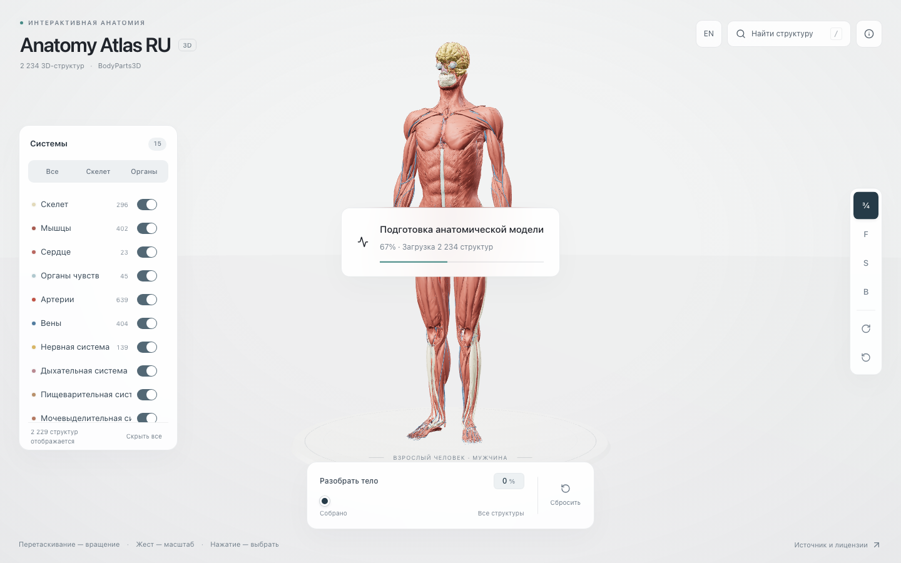
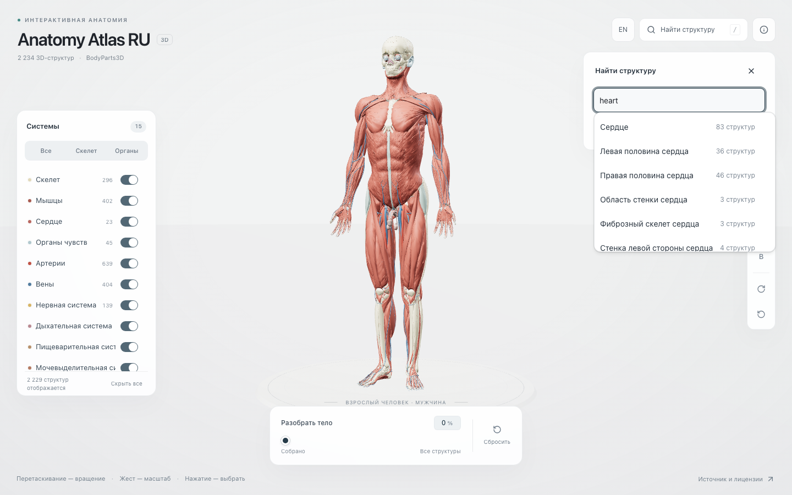
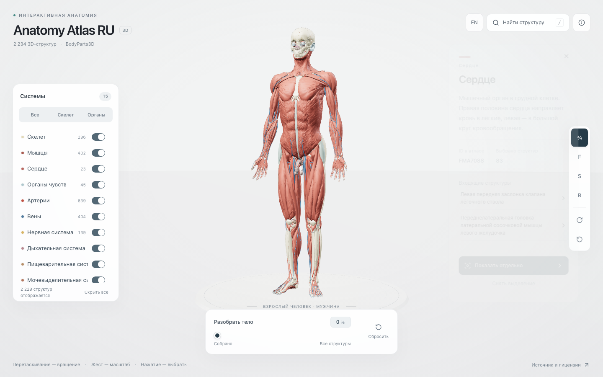
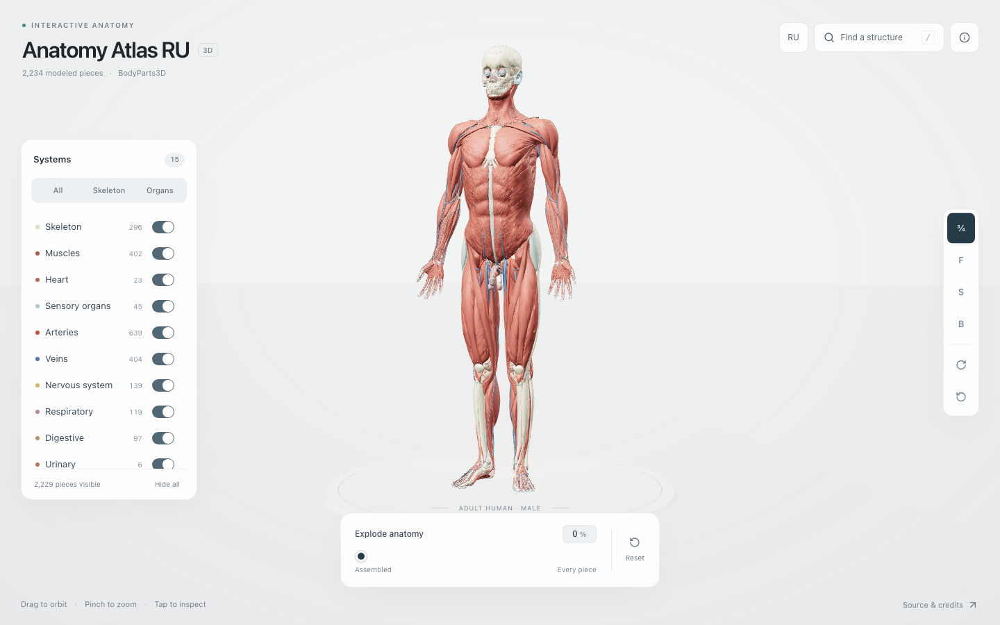
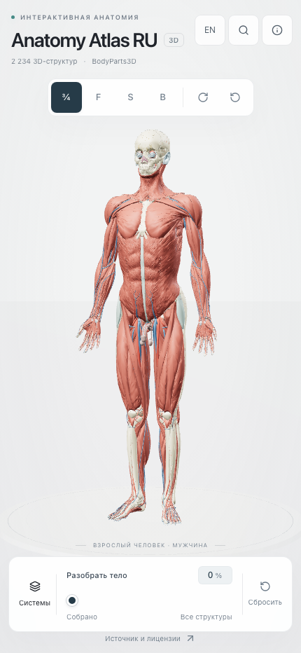

# Anatomy Atlas RU

An open-source Russian-language 3D human anatomy atlas based on BodyParts3D/FMA.
The application is based on [Human Atlas by ashemag](https://github.com/ashemag/human-atlas), with Russian localization and additional product changes maintained in this repository.

Открытый русскоязычный 3D-анатомический атлас человека для образовательного и справочного использования.

## Возможности

- интерактивная WebGL-модель взрослой мужской референсной анатомии;
- 3 432 анатомические структуры и русская локализация 3 432/3 432 concepts;
- интерфейс и карточки структур на русском и английском языках;
- поиск по русским и английским названиям, aliases и FMA ID;
- выбор структуры, detail card, связанные части, изоляция и режим разборки;
- responsive UI для desktop, tablet и mobile;
- базовая keyboard/accessibility поддержка;
- локальная работа без API-ключей, аналитики и телеметрии; privacy-friendly Umami analytics включается только в production web на GitHub Pages.

Подробности о событиях и собираемых данных: [docs/ANALYTICS.md](docs/ANALYTICS.md).

## Скриншоты











## Try it online

Откройте web-версию в браузере: [Anatomy Atlas RU на GitHub Pages](https://zigmyndovi4-ship-it.github.io/anatomy-atlas-ru/).
Она собирается из того же исходного дерева, что и desktop-приложения.

## Desktop downloads

| Platform | Format | Architecture |
| --- | --- | --- |
| Web | Browser | любой современный браузер |
| macOS | DMG | Apple Silicon (`aarch64`) |
| Windows | EXE | `x86_64` |

Установщики v0.1.1 будут доступны в [GitHub Releases](https://github.com/zigmyndovi4-ship-it/anatomy-atlas-ru/releases).

## macOS: если система пишет, что приложение повреждено

В v0.1.1 приложение не подписано Apple Developer ID и не прошло notarization.
Поэтому macOS иногда показывает сообщение «Приложение повреждено, и его не
удается открыть». Обычно это означает, что Gatekeeper заблокировал unsigned
приложение, а не что DMG действительно повреждён.

Перед запуском скачайте DMG только со [страницы релиза](https://github.com/zigmyndovi4-ship-it/anatomy-atlas-ru/releases)
и убедитесь, что это официальный файл проекта.

1. Скопируйте `Anatomy Atlas RU.app` из DMG в `/Applications`.
2. Откройте Terminal.
3. Выполните команду только для приложения, скачанного из официального релиза:

```bash
xattr -dr com.apple.quarantine "/Applications/Anatomy Atlas RU.app"
```

После этого запустите приложение обычным способом. Команда снимает quarantine
только с указанного bundle и не отключает Gatekeeper для всей системы. Это
временное ограничение unsigned-сборки v0.1.1; в будущей версии планируется
подписанный и notarized macOS installer.

## Запуск

Требования: Node.js 22.13+ и npm.

```sh
npm install
npm run dev
```

Откройте <http://localhost:3016>.

Production-сборка:

```sh
npm run build
```

Начиная с v0.1.1, GitHub Actions собирает desktop-пакеты из этого же
Vite/React-приложения.

Первые сборки не подписаны коммерческими сертификатами: macOS может показать
предупреждение разработчика, а Windows — предупреждение SmartScreen. Не
отключайте системные средства защиты целиком; проверяйте источник и checksum
релиза.

GitHub Release assets имеют собственный `download_count`, который можно
проверять через GitHub API. Это число не равно web-трафику GitHub Pages.

## Проверки

```sh
npm run test:smoke
npm run test:e2e
npm run check
npm run build
```

Playwright suite проверяет Chromium/WebGL, поиск, selection flow, RU/EN toggle,
responsive layout и отсутствие console/network errors на desktop, tablet и mobile.

## Источники данных

Анатомическая модель и исходные метаданные происходят из BodyParts3D 4.0,
© The Database Center for Life Science. Concept IDs и английские названия
связаны с FMA. Terminologia Anatomica 2 / FIPAT использовалась как один из
источников терминологической сверки в QA-проходах.

Русский словарь этого проекта не является официальным изданием TA2 и не
утверждает воспроизведение полного русского TA2.

## Лицензии и attribution

- код приложения — [MIT License](LICENSE);
- исходный проект — [Human Atlas by ashemag](https://github.com/ashemag/human-atlas), авторство и лицензия сохранены;
- анатомические данные BodyParts3D — [CC BY 4.0](https://creativecommons.org/licenses/by/4.0/);
- полная attribution, ссылки на источники и сведения об адаптации — [public/ATTRIBUTION.md](public/ATTRIBUTION.md);
- сводка credits — [public/CREDITS.md](public/CREDITS.md).

Не заявляются права на исходную геометрию и данные сверх условий соответствующих лицензий.

## Статус

**v0.1.1 — первый desktop release.**

Локализация завершена: 3 432 из 3 432 concepts заполнены. Smoke, typecheck,
build и Chromium/WebGL e2e QA проходят. Известные ограничения перечислены в
[release notes](docs/RELEASE_NOTES_v0.1.1.md).

## Roadmap

- дальнейшее улучшение визуального UX и поиска;
- улучшение desktop app;
- избранное и связанные структуры;
- учебный режим и дополнительные тесты;
- optional AI explanations без изменения базовых анатомических данных.

Сроки не обещаются; roadmap не является обязательством по релизам.

## Contributing

См. [CONTRIBUTING.md](CONTRIBUTING.md). Приветствуются issues, bug reports,
предложения исправлений терминологии и pull requests с понятным описанием.

## Disclaimer

Проект предназначен только для образовательных и справочных целей. Он не
является заменой профессиональной медицинской консультации, диагностики,
лечения или хирургической навигации.
